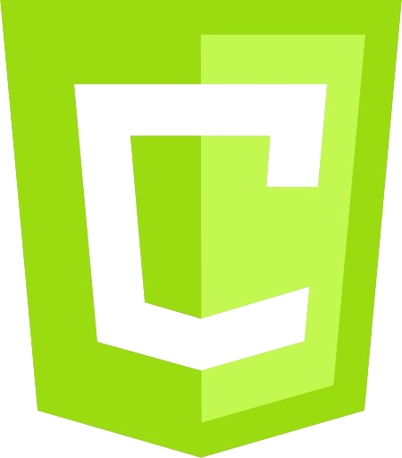

# CURSO DE CANVAS
👨‍⚖️O CANVAS É UM ELEMENTO HTML5 QUE PERMITE DESENHAR GRÁFICOS E ANIMAÇÕES DIRETAMENTE NA PÁGINA WEB USANDO JAVASCRIPT.

  

## CONCEITO:
### 1. O QUE É O `<CANVAS>`?
O `<canvas>` é um elemento HTML5 que define uma área de desenho em uma página web. Ele atua como uma "tela em branco" onde você pode desenhar gráficos, formas, imagens e animações usando JavaScript. O `<canvas>` é especialmente útil para criar gráficos dinâmicos e interativos, como jogos, visualizações de dados e animações.

### 2. CONTEXTO DE DESENHO:
Para desenhar no `<canvas>`, você usa o conceito de "contexto de desenho". O contexto é uma interface que fornece as ferramentas e métodos necessários para criar e manipular gráficos. Existem dois tipos principais de contextos:

- **Contexto 2D**: Permite criar gráficos bidimensionais, como linhas, formas, imagens e texto. É o contexto mais comum e é usado para a maioria dos trabalhos gráficos em `<canvas>`.
  
- **Contexto WebGL**: Permite criar gráficos tridimensionais (3D) usando a API WebGL. É mais complexo e é utilizado para jogos 3D e visualizações avançadas.

### 3. COORDENADAS E TAMANHO:
O `<canvas>` tem um sistema de coordenadas onde a posição dos pixels é especificada por suas coordenadas X e Y. A coordenada (0,0) está no canto superior esquerdo da área de desenho, com as coordenadas aumentando à medida que você se move para a direita e para baixo.

- **Largura e Altura**: O `<canvas>` tem propriedades de largura e altura que definem o tamanho da área de desenho. Essas propriedades podem ser ajustadas para definir o tamanho da tela onde você está desenhando.

### 4. DESENHO E RENDERIZAÇÃO:
- **Formas e Gráficos**: O `<canvas>` permite desenhar uma variedade de formas, como linhas, retângulos e círculos. Também é possível preencher essas formas com cores e aplicar efeitos como gradientes e padrões.
  
- **Imagens e Texto**: Você pode desenhar imagens no `<canvas>`, bem como renderizar texto. O texto pode ser estilizado e posicionado de acordo com as necessidades do projeto.

### 5. ANIMAÇÃO E INTERATIVIDADE:
- **Animações**: O `<canvas>` permite criar animações atualizando o conteúdo da tela repetidamente em um loop. Isso é feito geralmente através de métodos de animação que redibujam o canvas em intervalos regulares.

- **Interatividade**: O `<canvas>` pode responder a eventos de usuário, como cliques e movimentos do mouse. Isso permite criar interfaces interativas e jogos.

### 6. DESEMPENHO E EFICIÊNCIA:
Desenhar no `<canvas>` pode ser intensivo em termos de processamento, especialmente para animações complexas e gráficos detalhados. É importante otimizar o código e minimizar operações desnecessárias para garantir um bom desempenho.

### 7. USO EM JOGOS E GRÁFICOS:
O `<canvas>` é frequentemente usado em jogos e aplicativos gráficos devido à sua flexibilidade e capacidade de renderizar gráficos dinâmicos. Ele permite o desenvolvimento de jogos 2D e 3D, simulações e visualizações interativas.

## CARACTERISTICAS:
### POSITIVAS:
1. **Flexibilidade e Controle**:
   - **Desenho Dinâmico**: Permite criar gráficos, formas, imagens e animações de maneira dinâmica, com controle total sobre o que e como é desenhado.
   - **Personalização**: Oferece a capacidade de personalizar praticamente todos os aspectos do gráfico, desde formas básicas até animações complexas.

2. **Integração com JavaScript**:
   - **Interatividade**: Facilita a criação de interfaces interativas e reativas, permitindo que o conteúdo do canvas responda a eventos do usuário, como cliques e movimentos do mouse.
   - **Atualizações Dinâmicas**: Ideal para criar conteúdo que muda em tempo real, como jogos e visualizações de dados.

3. **Desempenho Gráfico**:
   - **Renderização Rápida**: A renderização de gráficos 2D e 3D usando `<canvas>` pode ser muito eficiente, especialmente para aplicações que requerem renderização rápida de muitos elementos gráficos.

4. **Desenvolvimento de Jogos e Animações**:
   - **Acessibilidade**: Permite criar jogos e animações diretamente no navegador, sem a necessidade de plugins adicionais.
   - **Suporte a WebGL**: Para gráficos 3D, o contexto WebGL do `<canvas>` oferece uma poderosa API para renderizar gráficos tridimensionais.

5. **Compatibilidade**:
   - **Suporte Amplo**: É suportado por todos os navegadores modernos, o que o torna uma solução universal para gráficos na web.

### NEGATIVAS:
1. **Complexidade do Código**:
   - **Desenvolvimento Manual**: Criar gráficos complexos e animações pode exigir um código extensivo e detalhado, o que pode ser desafiador para desenvolvedores iniciantes.
   - **Gerenciamento Manual**: O gerenciamento de atualizações e renderizações pode ser trabalhoso e requer atenção cuidadosa ao desempenho e sincronização.

2. **Limitado a Gráficos e Animações**:
   - **Sem Suporte para DOM**: O `<canvas>` não suporta a manipulação direta do DOM (Document Object Model), o que significa que você não pode aplicar estilos CSS diretamente aos elementos desenhados ou interagir com eles como faria com elementos HTML padrão.

3. **Desempenho em Dispositivos Móveis**:
   - **Desempenho Variável**: Em dispositivos móveis e navegadores mais antigos, o desempenho pode variar, especialmente para animações complexas e gráficos intensivos.
   - **Consumo de Recursos**: Animações e gráficos intensivos podem consumir muitos recursos, afetando a performance geral da página.

4. **Dificuldade em Depuração**:
   - **Desafios de Debugging**: Depurar problemas gráficos pode ser mais complicado do que depurar elementos HTML ou CSS, pois o `<canvas>` não fornece uma representação visual direta do seu conteúdo.

5. **Responsividade e Escalabilidade**:
   - **Escalabilidade**: Ajustar o tamanho do canvas e garantir que o conteúdo se adapte a diferentes tamanhos de tela pode exigir trabalho adicional para manter a qualidade e a proporção dos gráficos.

## SUBSIDIOS:
- [CURSO CRIADO PELO "CFBCURSOS"](https://youtube.com/playlist?list=PLx4x_zx8csUgPYODrHLlIw3ibmGBudkHr&si=kLOHY39DjALX_d8s)
- [CURSO FEITO PELO VILHALVA](https://github.com/VILHALVA)
- [VEJA A DOCUMENTAÇÃO](https://developer.mozilla.org/en-US/docs/Web/API/Canvas_API)
- [LINGUAGEM DE MARCAÇÃO](https://github.com/VILHALVA/CURSO-DE-HTML-E-CSS)
- [LINGUAGEM DE PROGRAMAÇÃO](https://github.com/VILHALVA/CURSO-DE-JAVASCRIPT)
- [VEJA O MANUAL](./MANUAL.md)
- [VEJA A SINTAXE](./SINTAXE.md)
- [VEJA OS PROJETOS](https://github.com/VILHALVA?tab=repositories&q=topic:CANVAS)